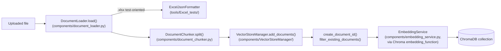

# Document ingestion: overview

**TL;DR:** an uploaded file goes load → chunk → embed → store, implemented by three separate modules that live in two different directories.

This section is split into pages that mirror the actual source layout, rather than one long page — so each page maps to one real module you'd open in an editor:

| Page | Source directory / files | Covers |
|---|---|---|
| [Loading & chunking](./loading-and-chunking.md) | `backend/components/document_loader.py`, `document_chunker.py`, `embedding_service.py` | `DocumentLoader`, `DocumentChunker`, `EmbeddingService` |
| [Vector store](./vector-store.md) | `backend/components/VectorStoreManager/` | `VectorStoreManager`, deduplication, search |
| [Excel parsing](./excel-parsing.md) | `backend/tools/Excel_tests/` | Low-level `.xlsx` cell/row parsing used by the test-oriented loader mode |

:::note Two different directories
`Excel_tests` lives under `backend/tools/`, not `backend/components/` — it's a standalone parsing toolkit that `DocumentLoader` (in `components/`) calls into, not a component in its own right.
:::

## Pipeline

For the request-level sequence (upload → progress polling → response), see [Request/response workflow](../../overview/workflow.md).
