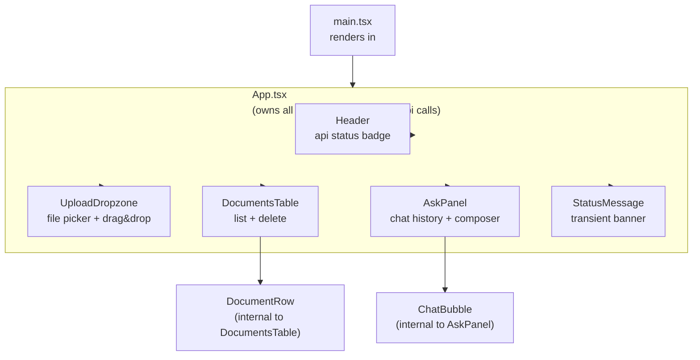

# Component structure

Source: `frontend/src/App.tsx` and `frontend/src/components/`.

**TL;DR:** one stateful `App` component orchestrating five "dumb" presentational sections — no router, no external state library.

There is no router — the frontend is a single page (`App`) composed of five presentational/interactive sections.

## Tree

`App` is the only component that holds state or calls the API layer (`frontend/src/api/ragApi.ts`); every other component is a controlled, presentational component driven entirely by props and callbacks passed down from `App`. `ChatBubble` (inside `AskPanel.tsx`) and `DocumentRow` (inside `DocumentsTable.tsx`) are private sub-components, not exported.

## Component responsibilities

| Component | File | Responsibility |
|---|---|---|
| `App` | `App.tsx` | "Main single-page container for document ingestion and RAG chat. Coordinates API calls, shared UI state, and cross-component interactions." |
| `Header` | `components/Header.tsx` | "Displays application title and backend status indicator." |
| `UploadDropzone` | `components/UploadDropzone.tsx` | "Provides drag-and-drop and file picker ingestion entry point." |
| `DocumentsTable` | `components/DocumentsTable.tsx` | "Displays indexed documents and allows refresh and delete actions." |
| `AskPanel` | `components/AskPanel.tsx` | "Renders the RAG chat area with message history and question composer." |
| `StatusMessage` | `components/StatusMessage.tsx` | "Renders a compact status banner for API and workflow feedback." |

See [Key components](./components.md) for props and behavior detail, and [State and data flow](./state-and-data-flow.md) for how `App` wires these together against the backend API.
