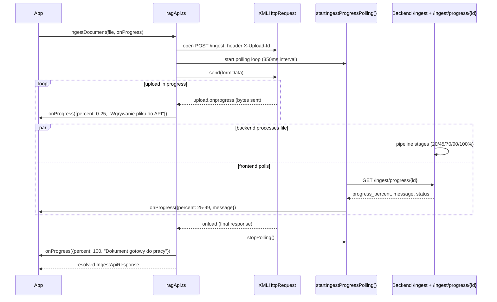

# State and data flow

Source: `frontend/src/App.tsx` and `frontend/src/api/ragApi.ts`.

**TL;DR:** `App` holds every piece of shared state in plain `useState`; a small `ragApi.ts` module does all the HTTP work and hands `App` a callback-based progress stream for uploads.

## State management

There is no external state library (no Redux/Zustand/Context store) — `App` holds all shared state locally with `useState` and passes values/callbacks down as props:

| State | Type | Purpose |
|---|---|---|
| `documentsResponse` | `DocumentsApiResponse \| null` | Last fetched `/documents` payload. |
| `messages` | `ChatMessage[]` | Full chat history (both `user` and `assistant` turns), kept only in memory — not persisted. |
| `question`, `topK` | `string`, `number` | Controlled inputs for `AskPanel`. |
| `apiStatus` | `ApiStatus` (`'checking' \| 'online' \| 'offline'`) | Derived from whether the last `/documents` or `/ask` call succeeded. |
| `isIngesting`, `isAsking`, `isDeleting` | `boolean` | Per-operation busy flags, each disabling its own UI section. |
| `uploadProgress` | `number \| null` | Combined 0–100 progress across all files in the current ingest batch. |
| `message` | `string` | Text shown by `StatusMessage` — reused for both success and error feedback. |

## API layer (`frontend/src/api/ragApi.ts`)

**TL;DR:** a thin fetch/XHR wrapper around the backend REST API — no UI logic, just requests and progress tracking.

> "Frontend API service for the RAG backend. This module performs HTTP requests and progress tracking only. It intentionally contains no UI-level business decisions."

Base URL: `import.meta.env.VITE_API_URL ?? 'http://127.0.0.1:8000'` (see [Configuration](../backend/configuration.md)).

| Function | Backend endpoint | Notes |
|---|---|---|
| `getDocuments()` | `GET /documents` | Plain `fetch` via the shared `requestJson()` helper. |
| `askQuestion(question, k)` | `POST /ask` | JSON body `{ question, k }`. |
| `ingestDocument(file, onProgress?)` | `POST /ingest` | Uses `XMLHttpRequest` (not `fetch`) specifically to get `xhr.upload.onprogress` events; see below. |
| `deleteDocument(source)` | `POST /documents/delete` | JSON body `{ source }` — the frontend always uses the body variant, never `DELETE /documents?source=`. |

:::note Error handling
`requestJson<T>()` throws an `Error` built from `readErrorMessage()` whenever `response.ok` is `false`. It reads the response's JSON `detail` field, falling back to a generic `"API zwrocilo blad {status}"` message if the body isn't valid JSON.
:::

### Ingest progress: two-phase percentage mapping

**TL;DR:** the 0–100% progress bar is stitched together from two unrelated sources — raw byte upload progress, then backend pipeline progress polled separately.

`ingestDocument()` generates a `crypto.randomUUID()` as the `X-Upload-Id` header and delegates to `uploadFormDataWithProgress()`, which combines two independent progress sources into one 0–100 value:



| Phase | Range | Source | Formula |
|---|---|---|---|
| Byte upload | 0–25% | `xhr.upload.onprogress` | `min(25, round(uploadPercent * 0.25))` |
| Backend pipeline | 25–99% | Polling `GET /ingest/progress/{uploadId}` every 350ms | `round(25 + progress_percent * 0.75)`, clamped to `[25, 99]` |
| Done | 100% | `POST /ingest` XHR resolves (`xhr.onload`, `2xx` status) | fixed `100` |

:::note Polling is resilient to transient failures
A `404` (progress not yet registered) or any fetch failure during polling just reschedules the next poll rather than failing the whole upload. Polling is stopped (`stopPolling()`, via the `isActive` flag and `clearTimeout`) both on success and on XHR error.
:::

`App.ingestFiles()` uploads files from a `FileList` **sequentially** (`for...of` with `await`), and further combines each file's own 0–100 progress into an overall batch percentage:

```ts
const overallProgress = Math.round(
  ((index + fileProgress.percent / 100) / totalFiles) * 100,
)
```

## End-to-end flows

### Ask flow (`App.handleAsk`)

**TL;DR:** optimistically show the user's message, then replace the "thinking" state with either the answer or an inline error bubble.

1. Guards on a non-empty trimmed `question`.
2. Optimistically appends a `user` `ChatMessage` to `messages` and clears the input.
3. Sets `isAsking = true`, calls `askQuestion(question, topK)`.
4. On success: appends an `assistant` message with `response.answer` and formatted `sources`; sets `apiStatus = 'online'`.
5. On failure: appends an `assistant` message whose content is the error text (via `getErrorMessage()`), and also surfaces it in the `StatusMessage` banner.

`formatSource()` builds each source label by joining whichever of these fields are present, with `" - "`:

- `file_name`
- `strona {page}` (page)
- `arkusz {sheet_name}` (sheet)
- `chunk {chunk_index}`

```ts
formatSource({ file_name: "report.pdf", page: 3, sheet_name: null, chunk_index: 2 })
// "report.pdf - strona 3 - chunk 2"
```

:::note Fallback label
If none of those fields are present, the label falls back to `"Nieznane zrodlo"` (unknown source).
:::

### Ingest flow (`App.ingestFiles`)

**TL;DR:** upload each selected file in turn, then refresh the document list once.

Sets `isIngesting = true` and an initial status message, uploads each file in sequence via `ingestDocument()` with the progress callback described above, then calls `refreshDocuments()` to reload `/documents` and shows a completion message — all within a single `try/finally` that always clears `isIngesting`/`uploadProgress`.

### Delete flow (`App.handleDeleteDocument`)

**TL;DR:** delete, then refresh the document list and report how many chunks were removed.

Sets `isDeleting = true` and a "Usuwam dokument z ChromaDB..." message, calls `deleteDocument(source)`, refreshes the document list, and reports `deleted_chunks_count` in the status banner.

### Error normalization (`getErrorMessage`)

**TL;DR:** one helper turns any thrown value into a safe, displayable string.

Returns `error.message` for real `Error` instances (which is what every `ragApi.ts` function throws on failure), or a generic fallback `"Wystapil nieznany blad podczas komunikacji z API."` for anything else — used identically across the ask, ingest, and delete flows.
