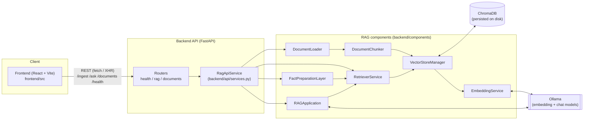

# Architecture

**TL;DR:** frontend talks only to the FastAPI backend; the backend owns ChromaDB and Ollama directly, and no component skips the layer above it.

## Component diagram



## Directory layout

```text
RAG_model/
|- backend/
|  |- api/
|  |  |- app.py            # FastAPI app factory, middleware, router wiring
|  |  |- config.py         # ApiSettings (env-driven configuration)
|  |  |- dependencies.py   # get_rag_service() DI provider
|  |  |- schemas.py        # Pydantic request/response models
|  |  |- services.py       # RagApiService orchestration layer
|  |  |- logging_context.py
|  |  |- routers/
|  |     |- health.py
|  |     |- rag.py
|  |     |- documents.py
|  |- components/
|  |  |- document_loader.py
|  |  |- document_chunker.py
|  |  |- embedding_service.py
|  |  |- rag_application.py
|  |  |- fact_processing/
|  |  |  |- models.py
|  |  |  |- parser.py
|  |  |  |- service.py
|  |  |- RetrieverService/
|  |  |  |- service.py
|  |  |  |- query_features.py
|  |  |  |- ranking.py
|  |  |  |- constants.py
|  |  |- VectorStoreManager/
|  |     |- service.py
|  |     |- deduplication.py
|  |     |- search.py
|  |- tools/
|     |- Excel_tests/      # low-level XLSX parsing used by DocumentLoader
|- frontend/
|  |- src/
|     |- App.tsx
|     |- api/ragApi.ts
|     |- components/
|- Docs/                   # uploaded source files land here (DOCS_DIRECTORY)
|- chroma_db/               # persisted Chroma collection (CHROMA_DIRECTORY)
|- docker-compose.yml
```

## Layers

| Layer | Role |
|---|---|
| **API routers** (`backend/api/routers/`) | Thin HTTP layer: validation, HTTP status codes, request/response mapping. No business logic. |
| **`RagApiService`** (`backend/api/services.py`) | Coordinates ingestion, retrieval, fact preparation, and answer generation for all endpoints. Owns one instance of every component below (constructed once via `get_rag_service()`, cached with `lru_cache`). |
| **`DocumentLoader` / `DocumentChunker` / `EmbeddingService`** | Turn a source file into embedded, chunked `Document` objects. |
| **`VectorStoreManager`** | Owns the Chroma collection: add (with dedup), similarity search, keyword search, metadata lookup, delete, count. |
| **`RetrieverService`** | Hybrid retrieval orchestration on top of `VectorStoreManager`: combines dense + sparse candidates, reranks them. |
| **`FactPreparationLayer`** | Turns retrieved documents into `raw`, `structured`, or `hybrid` LLM context, using the fact parser and query-intent detection. |
| **`RAGApplication`** | Builds the prompt (raw / structured / hybrid template, based on `context_kind`) and calls the Ollama chat model to generate the answer. |

For request-level detail, see [Request/response workflow](./workflow.md). For the internals of each backend layer, see the [Backend](../backend/rag-pipeline.md) section.
