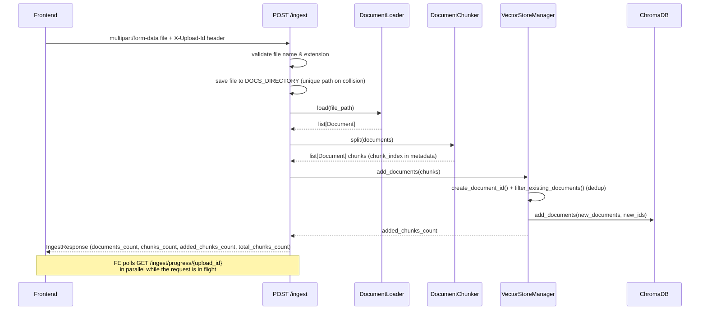
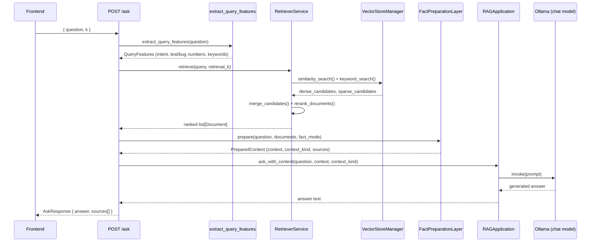
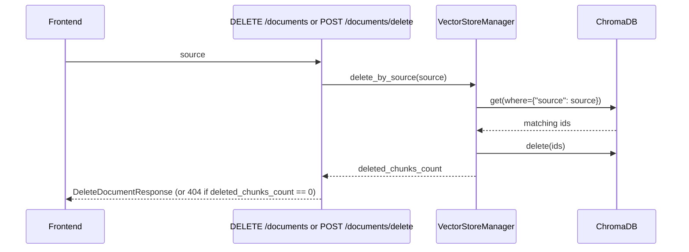

# Request/response workflow

## Ingest: from file upload to indexed chunks

Implemented by `ingest_document` in [`backend/api/routers/rag.py`](../backend/api-reference.md) and `RagApiService.ingest_file` in `backend/api/services.py`.

:::note How progress is tracked
Progress reporting is implemented with an in-process dictionary (`_INGEST_PROGRESS` in `rag.py`), guarded by a `Lock` and expired after `_INGEST_PROGRESS_TTL_SECONDS` (3600s). `RagApiService.ingest_file` accepts an `on_progress` callback invoked at each pipeline stage (20% loading, 45% chunking, 70% storing, 90% finalizing, 100% done), which the router maps into overall percentages via `report_service_progress`.
:::

## Ask: from question to grounded answer

Implemented by `ask_question` in `backend/api/routers/rag.py` and `RagApiService.ask` in `backend/api/services.py`.

:::note Three behaviors worth knowing about, from `RagApiService.ask`
- If `RAG_FACT_MODE` is not `raw` and the detected intent is `LIST_BUGS` or `AFFECTED_TEST_FULL`, the retrieval size is widened (`max(k, min(rag_fact_max_items, 80))`) so the fact layer has enough candidates to resolve full traceability, not just the top-`k` chunks.
- The list of `sources` returned to the frontend is built from `prepared.context_documents` — i.e. the (possibly expanded-for-traceability) document set used to build context, not the raw top-`k` retrieval result.
- If no context is found, `RAGApplication.ask_with_context` short-circuits and returns a fixed fallback string instead of calling the model.
:::

## Delete: removing a document

Implemented by `_delete_document_by_source` in `backend/api/routers/documents.py` and `RagApiService.delete_document`.

